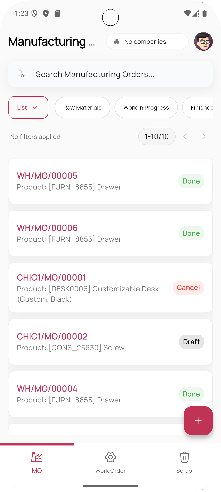
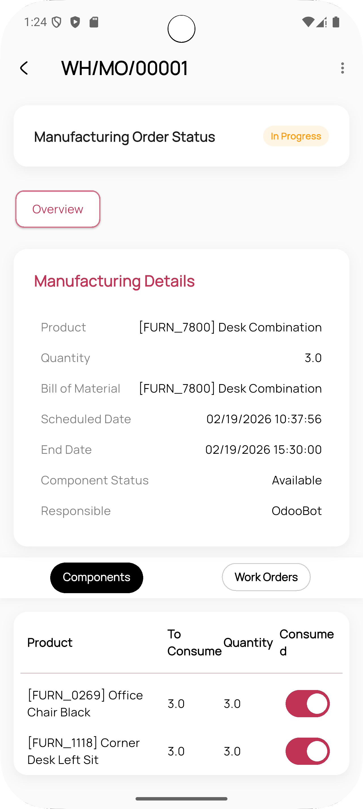
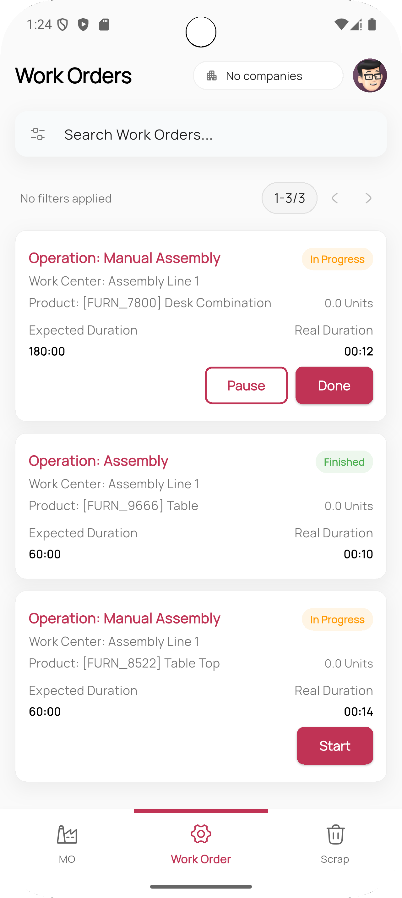
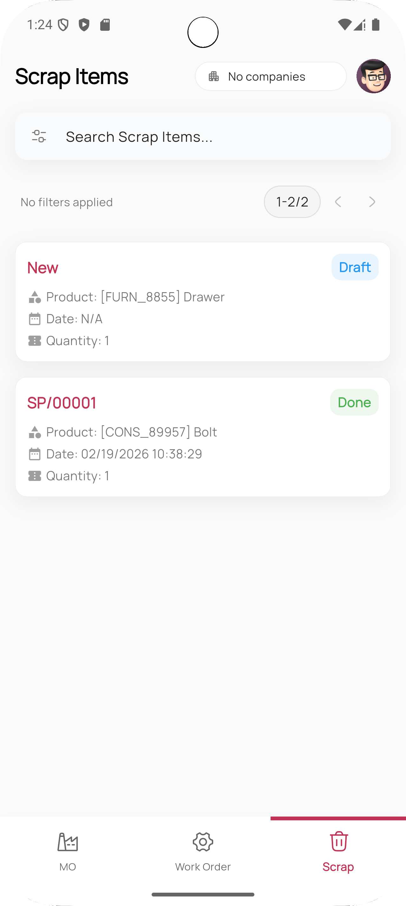

# Mobo Manufacturing


## Overview

**Mobo Manufacturing** is a professional first mobile application built with Flutter, designed to extend Odoo's Manufacturing Execution System (MES) to the shop floor. It empowers production operators, supervisors, and quality teams to manage the entire manufacturing lifecycle directly from their mobile devices, ensuring high productivity even in factory environments with limited connectivity.

## Key Features

### Manufacturing & Work Order Management
- **Full Lifecycle Support**: View, edit, and confirm Manufacturing Orders (MOs) from draft to completion.
- **Work Order Execution**: Real-time Start, Pause, and Finish actions for Work Orders.
- **Duration Tracking**: Precise live tracking with background/resume compensation.
- **Production Controls**: Perform Produce All, Cancel, Unbuild, and Scrap actions on the go.


### Quality & Traceability
- **Detailed Reporting**: Comprehensive traceability for finished goods and components (lots/serials).
- **Scrap Management**: Digital proofing for scrap with reason selection and replenishment wizards.
- **Inventory Integration**: Real-time component consumption and stock move updates.

### Shop Floor Excellence
- **Advanced UX**: Beautiful, responsive UI with Lottie animations and shimmer loading.
- **Accessibility**: Built-in dark mode and motion reduction support.
- **Enterprise Ready**: Multi-company switching, biometric login, and advanced data filtering.

## Screenshots

<div align="center">
  
  
  
  
</div>

## Supported Odoo Versions
- Tested with Odoo v17, v18 and v19.
- Recommended: Odoo v17+ for optimal performance.

## Platform Support
- **Android**: Compatible with Android 7.0 (API 24) and above.
- **iOS**: Compatible with iOS 12.0 and above.

## Technology Stack
- **Framework**: Flutter (Dart)
- **State Management**: Provider + BLoC
- **Backend Integration**: Odoo JSON-RPC
- **Authentication**: Odoo Session + Biometrics

## Permissions
The app requires the following permissions for full functionality:
- **Internet Access**: To synchronize data with the Odoo server.
- **Biometrics**: For secure and fast user authentication (optional).
- **Storage Access**: To cache production and traceability documents.

## Getting Started

### Prerequisites
- Flutter SDK (Stable Channel)
- Odoo Instance (v17+)
- Android Studio / Xcode / VS Code

### Installation

1. **Clone the repository**
   ```bash
   git clone https://github.com/mobo-suite/mobo_manufacturing.git
   cd mobo_manufacturing
   ```

2. **Install dependencies**
   ```bash
   flutter pub get
   ```

3. **Generate local adapters**
   ```bash
   dart run build_runner build --delete-conflicting-outputs
   ```

4. **Run the application**
   ```bash
   flutter run
   ```

## Configuration
1. **Server Setup**: Enter your Odoo server URL and database name on the first launch.
2. **Login**: Use your standard Odoo credentials.
3. **Biometrics**: Enable biometric login from the settings menu for faster access.

## Build Release

### Android
```bash
flutter build apk --release
```

### iOS
```bash
flutter build ios --release
```

## Usage
1. Open the application and configure your Odoo server connection.
2. Login with your credentials and select your active company.
3. Access the **MO Dashboard** to view your assigned Manufacturing Orders.
4. Open a **Work Order** and use the **Start/Pause/Finish** controls to track your work.
5. Record component consumption or scrap as items are processed.

## Troubleshooting
- **Connection Error**: Verify your server URL (protocol included) and ensure your device has internet access.
- **Login Failed**: Confirm your database name and user permissions in Odoo.
- **Sync Issues**: Check the sync queue in the dashboard for any pending or failed operations.

## Roadmap
- **Seamless offline-first Connectivity**: Full CRUD support without an internet connection.
- **Advanced QR/Barcode Scanning** for component lots.
- **Maintenance Integration** for equipment reporting.
- **Custom Print Templates** for production labels.

## Maintainers
- **Team Mobo** at Cybrosys Technologies
- For support, contact: mobo@cybrosys.com

## License
This project is primarily licensed under the **Apache License 2.0**.  
See the [LICENSE](LICENSE) file for the main license and [THIRD_PARTY_LICENSES.md](THIRD_PARTY_LICENSES.md) for details on included dependencies.
